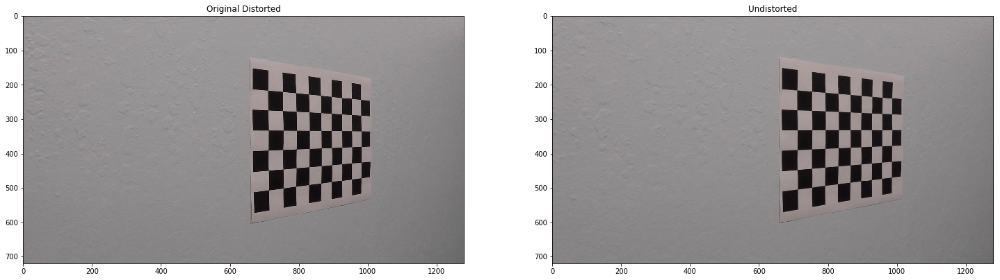
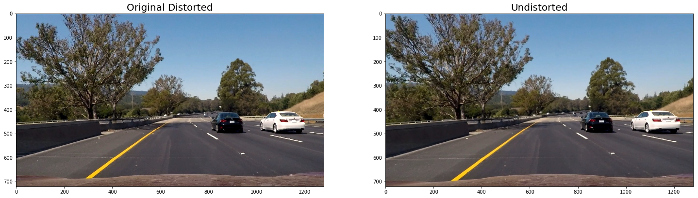
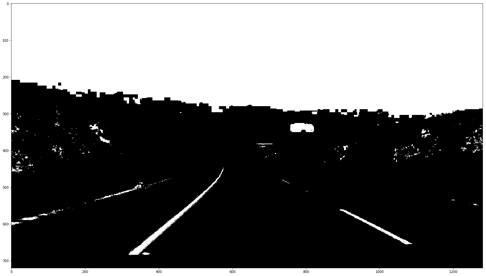
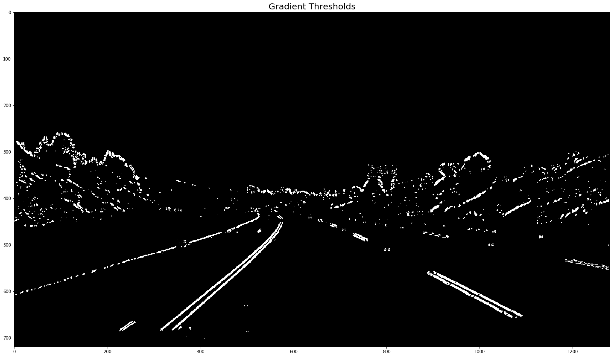
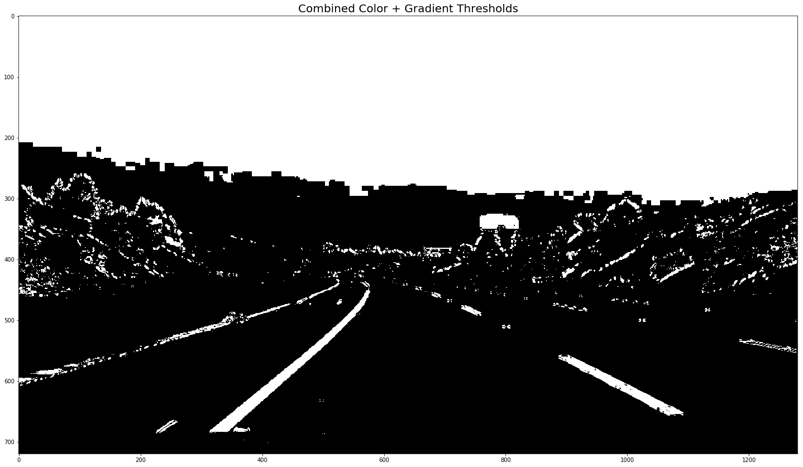
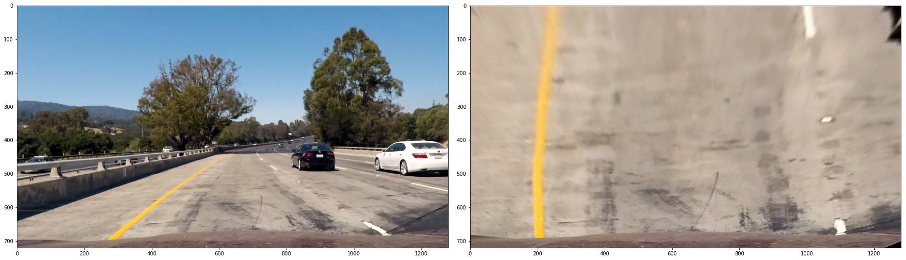
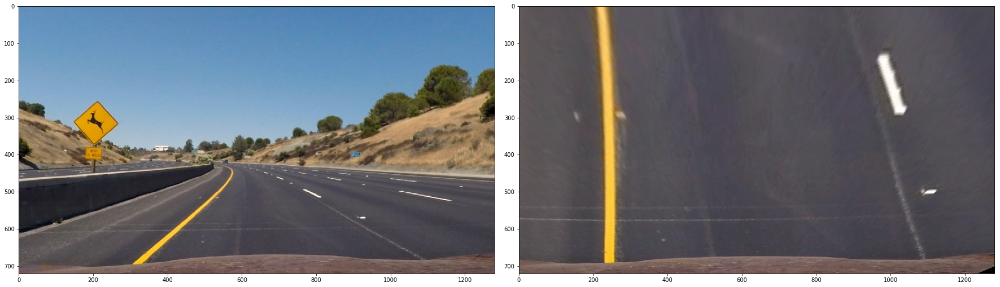
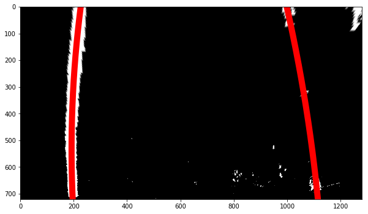
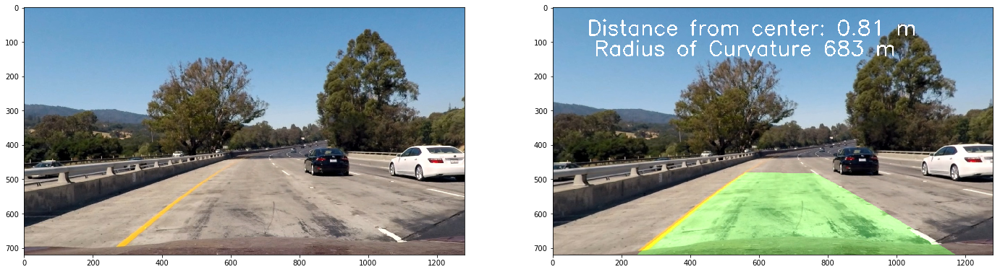

# **Advanced Lane Finding Project**
---
The goals / steps of this project are the following:

* Compute the camera calibration matrix and distortion coefficients given a set of chessboard images.
* Apply a distortion correction to raw images.
* Use color transforms, gradients, etc., to create a thresholded binary image.
* Apply a perspective transform to rectify binary image ("birds-eye view").
* Detect lane pixels and fit to find the lane boundary.
* Determine the curvature of the lane and vehicle position with respect to center.
* Warp the detected lane boundaries back onto the original image.
* Output visual display of the lane boundaries and numerical estimation of lane curvature and vehicle position.
---
### Camera Calibration

#### 1. Briefly state how you computed the camera matrix and distortion coefficients. Provide an example of a distortion corrected calibration image.

The code for this step is contained in the first code cell of the IPython notebook located in `Advanced Lane Project.ipynb`".

I start by preparing "object points", which will be the (x, y, z) coordinates of the chessboard corners in the world. Here I am assuming the chessboard is fixed on the (x, y) plane at z=0, such that the object points are the same for each calibration image.  Thus, `objp` is just a replicated array of coordinates, and `object_points` will be appended with a copy of it every time I successfully detect all chessboard corners in a test image.  `img_points` will be appended with the (x, y) pixel position of each of the corners in the image plane with each successful chessboard detection.

I then used the output `object_points` and `img_points` to compute the camera calibration and distortion coefficients using the `cv2.calibrateCamera()` function.  I applied this distortion correction to the test image using the `cv2.undistort()` function and obtained this result:



### Pipeline (single images)

#### 1. Provide an example of a distortion-corrected image.

To demonstrate this step, I will describe how I apply the distortion correction to one of the test images like this one:

I used the distortion matrix that I got from called `cv2.calibrateCamera` based on the chessboard
`object_points` and `image_points` to calibrate the camera. I then fed `mtx` and `dist` into a small call called `Calibration` that was in charge of holding the calibration data. Here's what that class looks like.
```python
class Calibration:
    def __init__(self, mtx, dist):
        self.__mtx  = mtx
        self.__dist = dist

    @property
    def mtx(self):
        return self.__mtx

    @property
    def dist(self):
        return self.__dist
```
I then used the following code to instantiate the calibration points and pass them down to the pipeline, which utilized them in the `undistort` function.
```python
_, mtx, dist, _, _ = cv2.calibrateCamera(object_points, img_points, (1280, 720), None, None)

calibration = Calibration(mtx=mtx, dist=dist)
pipeline = Pipeline(calibration)
```

The code for `undistort` looks like this
```python
def undistort(self, image):
    """Undistort the image given the distortion matrix and destination points"""
    return cv2.undistort(image,
        self.calibration.mtx,
        self.calibration.dist, None,
        self.calibration.mtx)
```
and was called from the pipeline to produce the follow image:

#### 2. Describe how (and identify where in your code) you used color transforms, gradients or other methods to create a thresholded binary image.  Provide an example of a binary image result.

I used a combination of color and gradient thresholds to generate a binary image. The code for color and gradient thresholds is located in the IPython notebook in the `Pipeline` cell. The functions responsible for the thresholds are located below the `undistort` function and above the `find_lane` function. In terms of color thresholds, I found that the using the `S` channel from the `HLS` color was very good at detecting the lane lanes. I also tried to use the `R` channel from `RGB` but found that it was too deficient and was not able to provide any utility. Instead, I opted instead for the `B` channel in the `Lab` color spaces and found that combining those two color thresholds did a very good job overall. For the gradient thresholds, I used both the `X` and `Y` Sobel gradients and combined them with the directional and magnitude gradients to find the places where the lanes lanes were clearly detected. I then combined both the color and gradient thresholds to form the binary image. Here's an example of my output for this step.

**Color Threshold**


**Gradient Thresholds**


**Combined Color and Gradient Thresholds**

#### 3. Describe how (and identify where in your code) you performed a perspective transform and provide an example of a transformed image.

The code for my perspective transform includes a function called `warp`, which appears in the `Pipeline` class in the IPython notebook. I chose the hardcode the source and destination points in the following manner:

```python
def warp(self, image):
    image_size = (image.shape[1], image.shape[0])

    source = np.float32(
        [[500, 480],
         [810, 482],
         [1250, 720],
         [40, 720]])

    destination = np.float32(
        [[0, 0],
         [1200, 0],
         [1200, 720],
         [0, 720]])

    matrix = cv2.getPerspectiveTransform(source, destination)
    inverse_matrix = cv2.getPerspectiveTransform(destination, source)
    warped_image = cv2.warpPerspective(image, matrix, image_size, flags=cv2.INTER_LINEAR)

    return warped_image, matrix, inverse_matrix
```

This resulted in the following source and destination points:

| Source        | Destination   |
|:-------------:|:-------------:|
| 500, 480      | 0, 0          |
| 810, 482      | 1200, 0       |
| 1250, 720     | 1200, 720     |
| 40, 720       | 0, 720        |

Here's how the `warp` function transforms the images.




#### 4. Describe how (and identify where in your code) you identified lane-line pixels and fit their positions with a polynomial?
To fit the lane lanes, I utilized the code provided in the Udacity lectures. You can find that code in the `find_lane` method in the `Pipeline` class. At a very high level, what this code is use a clever trick by using the histogram to detect where there are areas with a lot of non-empty vertical pixels, It does this by using a sliding windows approach, scanning a section of the picture of looking for pixel in a certain region. Once those pixels are found, it saved the location of those pixels and then uses `np.polyfit` to fit a lane to the lane. Here's what an example output of this function looks like.



#### 5. Describe how (and identify where in your code) you calculated the radius of curvature of the lane and the position of the vehicle with respect to center.

Here's the code that I used to accomplish this task. It was adapted from the Udacity lectures.
```python
def curvature_offset(self, ploty, lefty, righty, leftx, rightx):
    image_width, image_height = 1280, 720
    y_eval = np.max(ploty)

    lane_pixel_width = np.multiply(image_width, 0.57)
    meters_per_pixel_y = np.divide(23, image_height)
    meters_per_pixel_x = np.divide(3.7, lane_pixel_width)

    left_fit_cr = np.polyfit(lefty * meters_per_pixel_y, leftx * meters_per_pixel_x, deg=2)
    right_fit_cr = np.polyfit(righty * meters_per_pixel_y, rightx * meters_per_pixel_x, deg=2)

    # Adapted from Udacity lectures
    radius_curvature_left = ((1 + (2 * left_fit_cr[0] * y_eval * meters_per_pixel_y + left_fit_cr[1]) ** 2) ** 1.5) / np.absolute(2 * left_fit_cr[0])
    right_curverad = ((1 + (2 * right_fit_cr[0] * y_eval*meters_per_pixel_y + right_fit_cr[1]) ** 2) ** 1.5) / np.absolute(2 * right_fit_cr[0])
    curvature_radius = np.mean([radius_curvature_left, right_curverad])

    image_center = np.multiply(lane_pixel_width, meters_per_pixel_x) / 2
    car_center = np.mean([left_fit_cr, right_fit_cr])
    vehicle_offset = np.abs(image_center - car_center)

        return curvature_radius, vehicle_offset
```
#### 6. Provide an example image of your result plotted back down onto the road such that the lane area is identified clearly.

I implemented this step in lines in the `draw_lane` function. Here is an example of my result on a test image:



---

### Pipeline (video)

#### 1. Provide a link to your final video output.  Your pipeline should perform reasonably well on the entire project video (wobbly lines are ok but no catastrophic failures that would cause the car to drive off the road!).

Here's a [link to my video result](https://youtu.be/FJE9QzsSEVk).

---

### Discussion

#### 1. Briefly discuss any problems / issues you faced in your implementation of this project.  Where will your pipeline likely fail?  What could you do to make it more robust?

I've had some issues with shadows in the very beginning of the project but I have been able to fix the issues more or less. There are certain parts of the video on which the pipeline doesn't do as well, even though for the most part it does the job well. The parts of the videos where it struggles on certain frames is where then are right angled turns and the pipeline has trouble with the right dotted lane markings. Those lane markers are not not as well defined as the left lane and sometimes the color thresholding and gradients aren't able to get a good read. I think that in order to improve the pipeline I could use more color thresholds that could account for more color variations and play with the derivative thresholds to be a bit more accustomed to the different scenes. 
